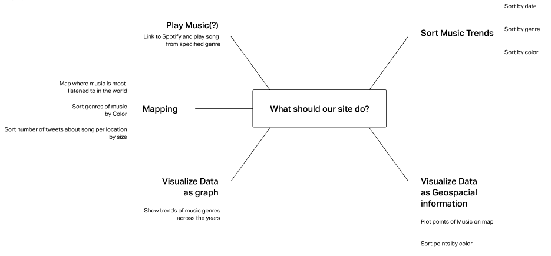
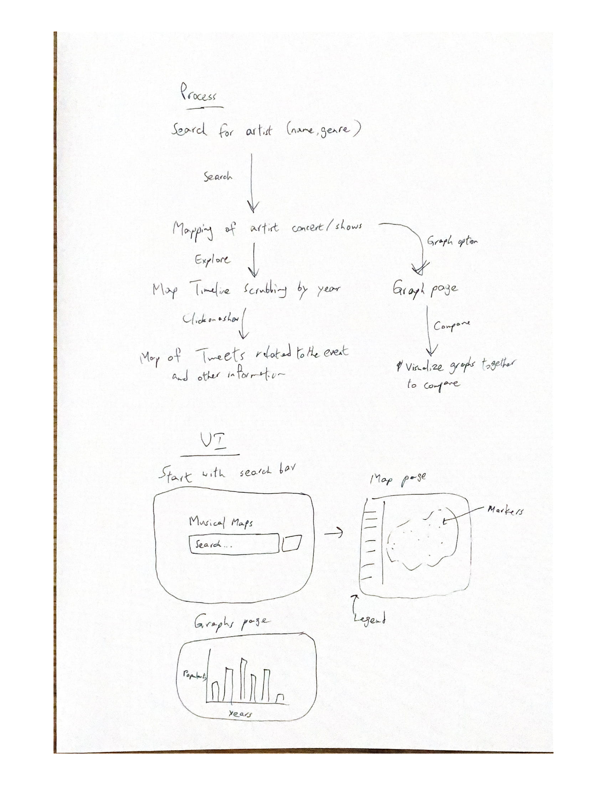
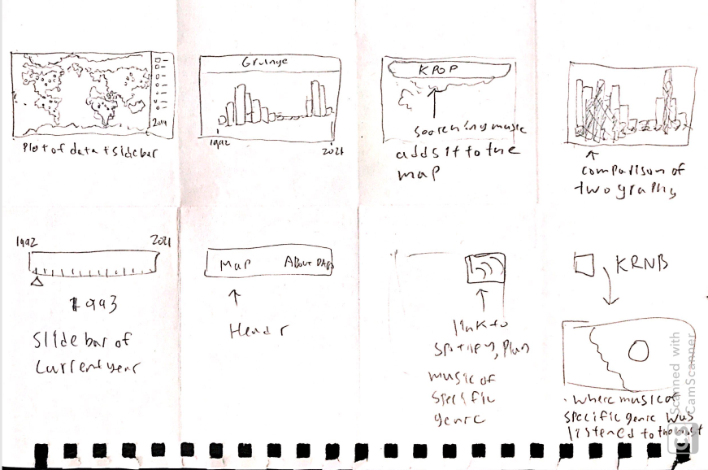
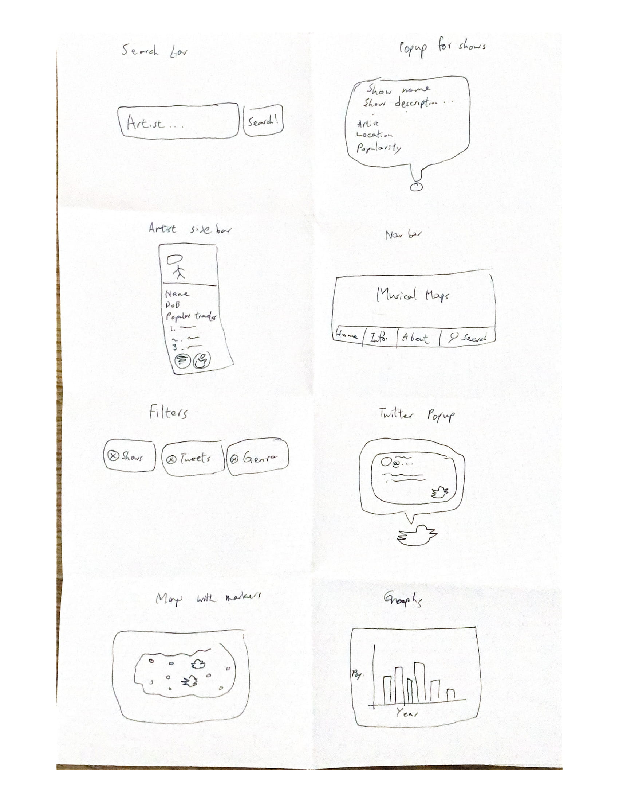
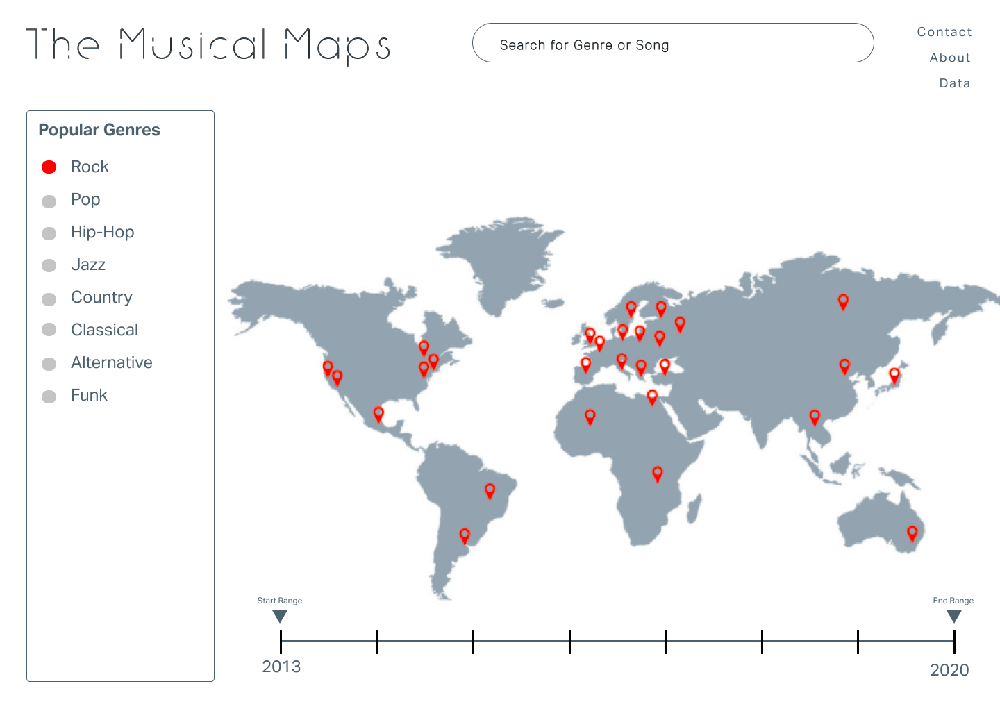

# Storyboard

### The Musical Maps: Justis Guardia, Daniel Liu, Kai Watanabe

## Mindmaps

Justis: 

Kai: 

Daniel: 

## Crazy Eights

Justis: 

Kai: 

Daniel: 

### Notes
When sharing our mind maps, we realized that we all prioritized similar aspects of our website. Specifically, these included accessibility, color coding, and interactivity. We also noted the importance of a user's process and navigation through our site, which will heavily impact our UX/UI design choices. Utilizing a variety of imagery centered around our main map was also a common through line in our maps as well. Within our crazy eights, we all included a search bar, emphasizing the importance of user interactivity to our group and on our site. Popups were also discussed as an important aspect of the map and markers, as well as a timeline or other way to filter by years. In regard to layering, we came to the conclusion that we would utilize different genres to divide that information, and the timeline with years to further specify the data shown on the map. We also agreed that the map would be the primary aspect of the site, meaning that it would be the main focus on our landing page. 

## Storyboard Collection

This is the wireframe of our home page. For the other pages of the site, see our figma:

https://www.figma.com/file/dibwrRAiCiim7DQi9APeIW/The-Musical-Maps?node-id=1%3A2
